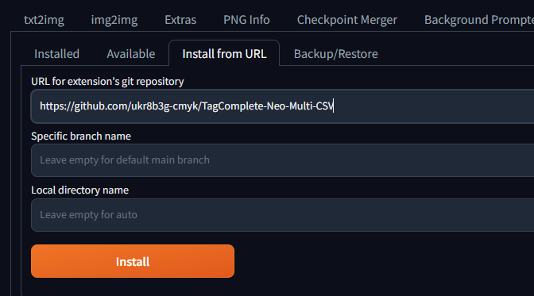
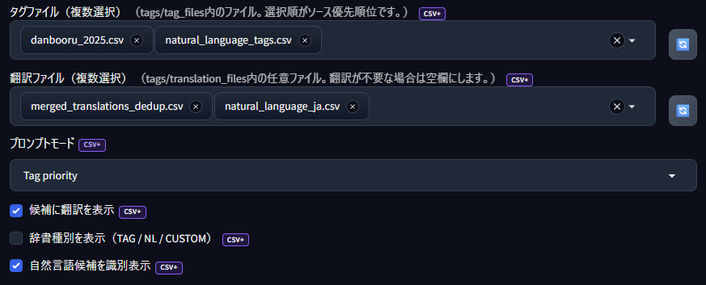
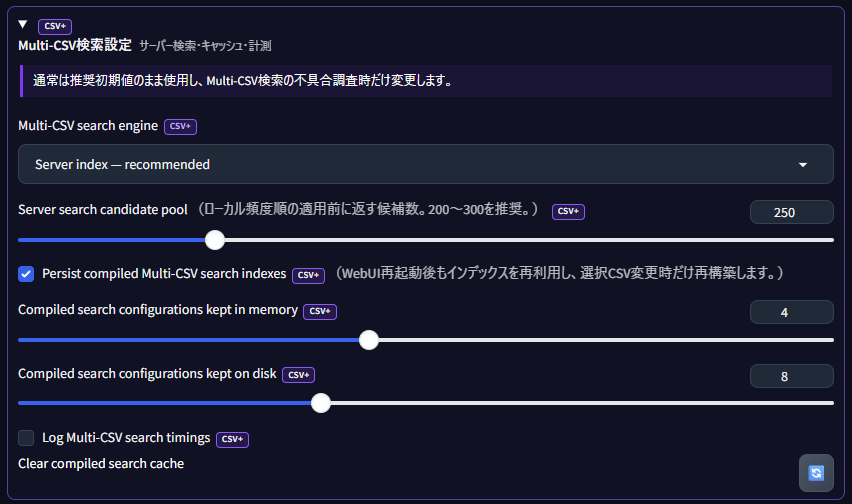
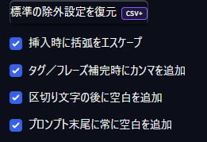
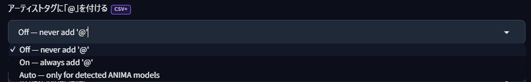
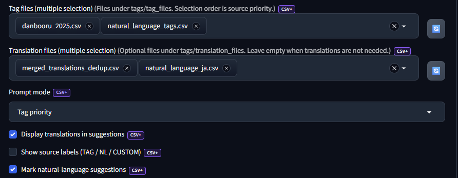
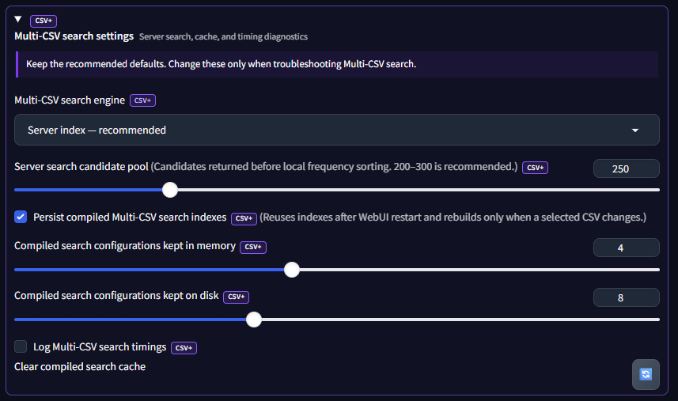
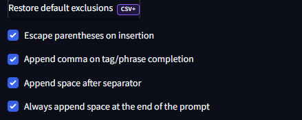
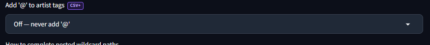

<div align="center">

# TagComplete Neo Multi-CSV

**[English](#english)**

## 複数のタグCSVを同時に読み込み・検索

**Load and search multiple tag CSV files at the same time**

Danbooru 2025、e621、自然言語、Anima、ユーザーCSVを、
モデルや用途に合わせて組み合わせられます。

**Forge Neo／reForge向け、複数CSV・翻訳検索・自然言語辞書対応のタグ補完拡張**

A Forge Neo and reForge compatible fork of TagComplete Neo with multiple CSV sources,
separate translation files, Japanese/translated search, natural-language
vocabularies, user presets, and safe prompt insertion.

</div>

> このプロジェクトは `sd-webui-tagcomplete-neo` を基盤としたフォークです。<br>
> 候補ポップアップ、キーボード操作、カテゴリ色、LoRA・Embedding・Wildcard・Chantなど、
> TagComplete Neoの操作感を維持しながら、Danbooru Tag JP Assistの辞書管理方式を統合しています。

### プロジェクトの系譜

```text
DominikDoom/a1111-sd-webui-tagcomplete
  └─ eduardoabreu81/sd-webui-tagcomplete-neo
       └─ ukr8b3g-cmyk/TagComplete-Neo-Multi-CSV
```

- **原点:** `a1111-sd-webui-tagcomplete` — TagCompleteの基本機能
- **直接のフォーク元:** `sd-webui-tagcomplete-neo` — Forge Neo対応、互換性・性能改善
- **このフォーク:** 複数タグCSV、分離翻訳CSV、自然言語辞書、
  サーバー検索、永続キャッシュ、ユーザープリセットを追加

元プロジェクトの機能と成果を尊重しつつ、本READMEはMulti-CSV版の実際の構成・
設定・検証結果に合わせて独自に記述しています。

---

## 日本語

### 対応環境

- Stable Diffusion WebUI Forge Neo
- Stable Diffusion WebUI reForge
- Gradio 3系・4系で異なる主要DOM構造を考慮

Forge NeoとreForgeの両方で実機動作を確認済みです。
通常のStable Diffusion WebUI Forgeは未確認のため、対応環境には含めていません。

主な用途:

- SDXL、Illustrious XL、Ponyなどのタグ中心モデル
- Animaなどのタグ・自然言語ハイブリッドモデル
- Krea 2、Z-Image、FLUX、Qwen-Imageなどの自然言語中心モデル

モデルごとに辞書を強制固定しません。CSV・モード・挿入形式はユーザーが変更できます。

### 主な機能

#### TagComplete Neoから維持する機能

- 入力中の候補ポップアップ
- 矢印キー、Tab、Enter、Escapeによる操作
- Danbooru / e621カテゴリ色と投稿数表示
- Alias・翻訳検索
- 使用頻度による候補順位調整
- 高速インデックス検索
- LoRA / LyCORIS / Embedding補完
- Extra Networkサムネイル
- LoRAトリガーワード挿入とCivitAI照会
- Dynamic Prompts形式のWildcard補完
- YAML Wildcard / UMI対応
- Chant補完
- モバイル向け入力負荷軽減

#### Multi-CSV版で追加した機能

- タグCSVと翻訳CSVを別フォルダで管理
- タグCSVを複数選択
- 翻訳CSVを複数選択
- Danbooru、自然言語、ユーザー辞書の同時利用
- 同一タグ、Alias、翻訳の統合
- 日本語・他言語翻訳による検索
- 日本語・翻訳表示のON/OFF
- `Tag` / `Hybrid` / `Natural Language` / `Custom`モード
- アンダースコア保護パターンのワイルドカード指定
- 大容量CSV向けサーバー検索とv6永続キャッシュ
- ユーザーが保存したプリセットだけを管理
- Animaアーティストタグへの`@`付与設定

### インストール

#### WebUIからインストール（推奨）

Forge NeoまたはreForgeの`Extensions` → `Install from URL`を開きます。



1. `URL for extension's git repository`へ次のURLを入力します。

   ```text
   https://github.com/ukr8b3g-cmyk/TagComplete-Neo-Multi-CSV
   ```

2. `Specific branch name`と`Local directory name`は空欄のままにします。
3. `Install`を押し、完了後にForge NeoまたはreForgeを再起動します。

#### Git clone

Forge NeoまたはreForgeの`extensions`フォルダーで実行します。

```powershell
cd "＜Forge-NeoまたはreForgeのインストール先＞\extensions"
git clone https://github.com/ukr8b3g-cmyk/TagComplete-Neo-Multi-CSV.git
```

#### ZIP

1. GitHubの`Code` → `Download ZIP`からZIPを取得して展開します。
2. 展開後のフォルダーをForge NeoまたはreForgeの`extensions`へ配置し、
   フォルダー名を`TagComplete-Neo-Multi-CSV`にします。

```text
Forge-Neo-or-reForge/
└─ extensions/
   └─ TagComplete-Neo-Multi-CSV/
      ├─ javascript/
      ├─ scripts/
      ├─ tags/
      └─ README.md
```

既に同名フォルダーがある場合は、上書きせず既存内容を確認してください。

#### 起動後

1. Forge NeoまたはreForgeを起動または再起動します。
2. Generate欄付近の状態ランプがオレンジから緑へ変わるまで待ちます。
3. `Settings` → `Tag Autocomplete / Multi-CSV`を開きます。
4. 設定変更後は`Apply settings`を押します。
   `requires Reload UI`と表示される項目だけUI再読み込みが必要です。

既存のTagComplete系拡張と同時に有効化すると、同じ入力欄へ複数の補完処理が登録される場合があります。
動作確認時は、他のTagComplete系拡張を一時的に無効化してください。

### 設定画面



主に変更する項目:

- **タグファイル（複数選択）:** 候補の本体となるタグ・自然言語CSV
- **翻訳ファイル（複数選択）:** 翻訳・別名を追加する任意CSV
- **プロンプトモード:** タグ優先、Hybrid、自然言語優先、同順位
- **候補に翻訳を表示:** 翻訳CSVの表示をON/OFF
- **辞書種別を表示:** `TAG` / `NL` / `CUSTOM`ラベルを任意表示
- **自然言語候補を識別表示:** 自然言語辞書の候補を見分けやすく表示
- **更新ボタン:** 対応するファイル一覧だけを再読込

通常利用では、最初の設定ブロックだけを確認すれば十分です。
最下部の`Multi-CSV検索設定`は、キャッシュ破損や性能調査時を除き推奨初期値のまま使用してください。

### データフォルダ

タグCSVと翻訳CSVは次のフォルダーへ同梱されます。ユーザーCSVも追加でき、
設定欄横の更新ボタンまたはWebUI再起動で一覧を更新できます。

```text
tags/
├─ tag_files/          # タグ・自然言語CSV
├─ translation_files/  # 翻訳・別名CSV
├─ chants/             # Chant JSON
├─ config/             # 内部設定、ユーザープリセット
├─ cache/              # 実行時キャッシュ
└─ temp/               # LoRA、Embedding、Wildcard等の一時一覧
```

CSVはサブフォルダにも配置できます。設定画面には相対パスで表示されます。

### 同梱データ

元のTagComplete Neoと同様、用途を比較しやすい表形式で記載します。

| ファイル | 出典・種別 | 主な用途 | 初期選択 |
|---|---|---|---|
| `danbooru_2025.csv` | TagComplete Neo / Danbooru 2025 | アニメ・SDXL・Illustrious系 | ✓ |
| `natural_language_tags.csv` | Multi-CSV追加・自然言語辞書 | 自然言語・ハイブリッド入力 | ✓ |
| `e621.csv` | TagComplete Neo / e621 | Furry・Anthro系 | — |
| `anima_artists.csv` | Multi-CSV追加・Animaアーティスト | Animaのアーティスト補完 | — |
| `anima_characters.csv` | Multi-CSV追加・Animaキャラクター | Animaのキャラクター補完 | — |
| `merged_translations_dedup.csv` | 統合・重複除去済み翻訳 | Danbooru系タグの日本語検索・表示 | ✓ |
| `natural_language_ja.csv` | 自然言語翻訳 | 自然言語候補の日本語検索・表示 | ✓ |

`danbooru_2025.csv`と`e621.csv`は
[sd-webui-tagcomplete-neo](https://github.com/eduardoabreu81/sd-webui-tagcomplete-neo)
から収録しています。複数CSVを選択できるため、事前に統合された
`danbooru_e621_merged.csv`は同梱しません。

> [!IMPORTANT]
> **`danbooru_2025.csv`と`e621.csv`の同時選択は対応済みです。**
> ただし、この2ファイルと`danbooru_e621_merged.csv`のようなマージ済みCSVを
> 同時に選択することは推奨しません。同一タグは1候補へ統合されるため検索が
> 壊れるわけではありませんが、重複データによってインデックス構築時間と
> メモリ使用量が増え、カテゴリ・件数・ソース優先順位も分かりにくくなります。
> **個別CSVの組み合わせか、マージ済みCSVのどちらか一方を使用してください。**

### タグCSV

推奨ヘッダー:

```csv
tag,category,count,aliases,translation,source_type,insert_mode,category_scheme
long_hair,0,3608339,"longhair","長髪",tag,tag,danbooru
soft natural lighting,,100,"soft light","柔らかな自然光",natural_language,phrase,natural_language
with,,50,,,natural_language,word,natural_language
special_identifier_name,,1,,,custom,raw,custom
```

必須列は`tag`だけです。

対応する主な列:

- `tag`: 候補名・挿入テキスト
- `category`: Danbooru / e621互換カテゴリ番号
- `count`: 投稿数または優先度
- `aliases`: 検索用別名。カンマまたはセミコロン区切り
- `translation`: 表示・検索用翻訳
- `source_type`: `tag` / `natural_language` / `custom`
- `insert_mode`: `tag` / `phrase` / `word` / `raw` / `wildcard`
- `category_scheme`: `danbooru` / `e621` / `derpibooru` / `danbooru_e621_merged`など

従来のTagComplete形式も読み込めます。

```csv
long_hair,0,3608339,"longhair"
```

ヘッダーや種別列がない場合、ファイル名から可能な範囲で推定します。
`EnglishDictionary.csv`、`natural_language`、`krea`、`flux`、`qwen`などを含む名前は
自然言語辞書として扱われます。

### 翻訳CSV

推奨形式:

```csv
tag,ja,aliases
long_hair,"長髪,ロングヘア","髪が長い"
blue_eyes,"青い目,碧眼","ブルーアイ"
```

汎用形式も利用できます。

```csv
tag,translation,aliases
long_hair,"long hair","flowing hair"
```

従来の2列形式も利用できます。

```csv
long_hair,長髪
```

翻訳CSVを選択しなければ、翻訳機能なしで通常のTagCompleteとして動作します。
日本語専用の固定処理ではないため、他言語の翻訳CSVも利用できます。

### 複数CSVとサーバー検索



`Tag files`と`Translation files`は複数選択ドロップダウンです。

例:

```text
Tag files:
- danbooru_2025.csv
- natural_language_tags.csv
- e621.csv
- my_custom_tags.csv

Translation files:
- merged_translations_dedup.csv
- natural_language_ja.csv
```

統合時の動作:

- 同じタグは候補に1件だけ表示
- Aliasと翻訳は重複を除いて統合
- `count`は最大値を採用
- 有効なカテゴリ情報を維持
- 読み込み元ファイルと辞書種別を内部保持
- 選択順をソース優先順として扱う

これは候補データの重複統合です。入力済みプロンプト本文を自動削除・整形する機能ではありません。

推奨の`Server index`では、統合済み全データをブラウザへ送らず、
Python側に保持して現在の検索に必要な候補だけを返します。

- 最初の検索で、選択中CSV構成のv6検索インデックスを構築
- 同じセッションではメモリキャッシュを利用
- Forge Neo再起動後はディスクキャッシュから復元
- 選択CSVのファイル名・サイズ・更新日時が変わると自動再構築
- キャッシュは`tags/cache/fast-search-v6/`へ保存
- ブラウザへ返す候補数は`Server search candidate pool`で制限

大きなCSVを増やすほど、初回構築時間とPython側のメモリ使用量は増えます。
一方、Server indexではブラウザへ全CSVを転送しないため、クライアント負荷は候補プール内に抑えられます。
通常は用途に必要な辞書だけを選択してください。

性能設計と実機計測の詳細は[PERFORMANCE.md](PERFORMANCE.md)を参照してください。

### プロンプトモード

#### Tag priority

Danbooruなどのタグ辞書を優先します。SDXL、Illustrious XL、Pony系などに向く初期設定です。

#### Auto (Hybrid)

タグ辞書と自然言語辞書を同時利用します。カンマ区切りのタグ入力ではタグを、
文章状の入力では自然言語候補をやや優先します。Animaなどを想定しています。

#### Natural language priority

自然言語辞書を優先します。Krea 2、Z-Image、FLUX、Qwen-Imageなどを想定しています。

#### Equal priority

選択CSVと設定をそのまま使用します。

モードは検索順位と挿入規則を調整します。CSV選択を強制的に固定するものではありません。

### 表示言語

`表示言語`を`日本語`にすると、Multi-CSV追加項目だけでなくTagComplete Neo標準設定の
項目名も日本語で表示します。`Auto`ではForge NeoのLocalization設定またはブラウザー言語に
合わせます。設定値やJSON内のキーは翻訳せず、互換性を維持します。

### ユーザープリセット

現行版では、Danbooru・SDXL・Animaなどの標準プリセットは表示せず、
ユーザーが保存したプリセットだけを管理します。

利用できる操作:

- 現在のMulti-CSV設定を名前付きで保存
- 保存済みプリセットを適用
- 保存済みプリセットを削除
- JSONへエクスポート
- JSONからインポート
- 選択中のCSVが別環境に存在しない場合、その参照だけを安全に除外して適用

既存のユーザープリセットデータは維持されます。
保存済みプリセットがない場合は「保存済みプリセットなし」と表示されます。

### 検索

- 英語タグ
- 英語Alias
- 日本語・他言語翻訳
- 翻訳Alias
- 自然言語の単語・フレーズ
- ユーザー辞書

検索順位:

1. 完全一致
2. 前方一致
3. 単語先頭一致
4. 部分一致

検索時は`_`と空白を同一視します。日本語・翻訳検索と翻訳表示は別々に切り替えられます。
そのため、日本語で検索しつつ候補表示を英語だけにすることも可能です。

### 候補表示

初期表示はTagComplete Neoを踏襲します。

- カテゴリ色
- 投稿数
- Alias / 翻訳
- 使用頻度マーカー
- 既出タグマーカー
- Extra Networkプレビュー

追加表示は任意です。

- `Show source labels`: `TAG` / `NL` / `CUSTOM`
- `Mark natural-language suggestions`
- `Display translations in suggestions`

ソースラベルは初期値OFF、自然言語識別と翻訳表示は初期値ONです。

### 挿入形式



設定可能な項目:

- アンダースコアを空白へ変換
- カンマを追加
- 区切り後にスペースを追加
- 文末にスペースを追加
- 括弧をエスケープ
- アンダースコア変換除外パターン

推奨初期値では通常タグを次のように挿入します。

```text
long hair, blue eyes, looking at viewer,
```

実際の初期設定では末尾にスペースも追加されます。

`insert_mode`の動作:

- `tag`: カンマ＋スペース
- `phrase`: カンマ＋スペース
- `word`: スペースのみ
- `raw`: 文字列を変換せず挿入
- `wildcard`: Wildcard構文を完全保持

自然言語CSVに`insert_mode`がない場合、単語1個は`word`、複数語は`phrase`として推定します。

### Animaアーティストタグの`@`付与



`アーティストタグに「@」を付ける`は、アーティスト候補を挿入する際の接頭辞を制御します。

- **Off:** `@`を付けない。初期値
- **On:** 対象アーティストタグへ常に`@`を付ける
- **Auto:** 読み込まれているモデルがANIMA系と判定された場合だけ`@`を付ける

Anima以外のモデルや、モデル判定に依存させたくない場合は`Off`または`On`を明示してください。

### アンダースコア保護

除外欄はカンマ区切り・改行区切りに対応し、`*`と`?`を使えます。

初期値には次のような構文依存タグを含みます。

```text
score_*
^_^
>_<
@_@
=_=
o_o
x_x
u_u
|_|
||_||
0_0
3_3
6_9
._.
+_+
+_-
(o)_(o)
<o>_<o>
```

例:

```text
score_8_up  -> score_8_up
long_hair   -> long hair
```

旧式のDanbooru表記をすべて保護するのではなく、構文上アンダースコアが必要な項目だけを保護します。

### Dynamic Prompts / Wildcard

次のような構文は常にそのまま扱います。

```text
__wildcards/eye-color__
```

- 前後の`__`を維持
- 内部の`/`、`-`、`_`を維持
- 通常タグのアンダースコア変換を適用しない
- 通常タグ用のカンマを自動追加しない

Wildcard ManagerやDynamic Promptsの既存ファイル構成を変更しません。

### 詳細設定／トラブルシューティング

設定ページ最下部に、通常は変更しない項目を2つのアコーディオンへ分けています。
どちらも初期状態は閉じています。通常利用では初期値のままにしてください。

`TagComplete Neoインターフェース設定（CORE）`:

- `Configure Hotkeys`: 候補操作キーをJSONで変更
- `Configure colors`: Danbooru／e621カテゴリ色をJSONで変更
- `Refresh internal temp files`: WildcardやEmbeddingなどの内部一覧を再作成

`Multi-CSV検索設定（CSV+）`の推奨値:

| 項目 | 推奨値 | 用途 |
|---|---:|---|
| `Multi-CSV search engine` | `Server index` | サーバー側インデックス検索 |
| `Server search candidate pool` | `250` | ローカル頻度順位へ渡す候補数 |
| `Persist compiled Multi-CSV search indexes` | ON | 再起動後にディスクキャッシュを再利用 |
| `Compiled search configurations kept in memory` | `4` | セッション内のCSV構成保持数 |
| `Compiled search configurations kept on disk` | `8` | ディスク上のCSV構成保持数 |
| `Log Multi-CSV search timings` | OFF | 性能調査時だけ有効化 |

`Clear compiled search cache`は、キャッシュ破損やCSV更新が反映されない場合だけ実行してください。
通常はCSV変更を自動検出するため、手動削除は不要です。

`Extra filename`と`Chant filename`の右横にある更新ボタンは、それぞれCSV一覧と
Chant JSON一覧だけを再読込します。Forge Neo全体をリロードするボタンではありません。

ホットキーと候補色は有効なJSONである必要があります。不具合の原因を切り分ける場合を除き、
既定値を変更しないことを推奨します。

### 対象外

この拡張は候補の検索・表示・挿入に集中します。次は実装していません。

- プロンプト全体の自動整形
- 入力済みタグの自動重複削除
- クリップボード内容の自動整形
- ペースト時の自動変換
- Booru Structure処理
- JSONプロンプト生成
- TagComplete UIと別の第二候補UI

### オフライン検証

展開した拡張フォルダで次を実行すると、Python構文、JavaScript構文、
辞書統合、プリセット、Wildcard保護などをまとめて確認できます。

```bash
python tools/verify_extension.py
```

これはForge Neo本体を起動しない検証です。最終確認ではForge Neoの実環境で、
CSV選択、候補表示、LoRA・Embedding・Wildcard補完、設定保存を確認してください。

### トラブルシューティング

#### CSVを追加しても表示されない

- 設定欄横の更新ボタンを押す
- `Apply settings`を押す
- 必要に応じて`Reload UI`
- CSVが`tags/tag_files`または`tags/translation_files`にあることを確認

#### 候補が二重に表示される

他のTagComplete系拡張が同時に有効になっていないか確認してください。

#### 補完が出ない

- `Enable Tag Autocompletion`を確認
- 対象タブの`Active in ...`を確認
- Tag filesが1件以上選択されているか確認
- ブラウザ開発者コンソールとWebUIコンソールを確認

#### 自然言語に不要なカンマが付く

辞書の対象行に`insert_mode=word`または`insert_mode=raw`を指定してください。

#### 特殊タグのアンダースコアが消える

`Underscore replacement exclusion patterns`へ完全名またはパターンを追加してください。

#### 最初の検索だけ時間がかかる

初回は選択中CSVのインデックス構築、または再起動後のディスクキャッシュ復元が発生します。
同じセッションの2回目以降はメモリキャッシュを利用します。
継続的に遅い場合だけ`Log Multi-CSV search timings`を有効にして確認してください。

---

## English

### Project lineage

```text
DominikDoom/a1111-sd-webui-tagcomplete
  └─ eduardoabreu81/sd-webui-tagcomplete-neo
       └─ ukr8b3g-cmyk/TagComplete-Neo-Multi-CSV
```

This repository is directly derived from `sd-webui-tagcomplete-neo`, which is
itself a Forge Neo fork of DominikDoom's original TagComplete extension. This
fork retains the established completion UI and providers while adding multiple
tag CSVs, separate translation CSVs, natural-language dictionaries,
server-side search, persistent caching, and user presets.

### Overview

TagComplete Neo Multi-CSV keeps the familiar autocomplete UI and existing
completion providers while adding a multi-source dictionary layer inspired by
Danbooru Tag JP Assist.

Key additions:

- Separate `tag_files` and `translation_files` directories
- Multi-select tag and translation CSV settings
- Deduplicated merging of tags, aliases, translations, counts, and categories
- Optional translated search and translated display
- Natural-language dictionaries and Tag / Hybrid / Natural Language modes
- Glob-style underscore exclusion patterns
- Server-side search with a persistent v6 cache
- User-only presets without bundled model presets
- Configurable `@` prefix for Anima artist tags

### Installation

#### Install from the WebUI (recommended)

Open `Extensions` → `Install from URL` in Forge Neo or reForge.


1. Enter the following address in `URL for extension's git repository`:

   ```text
   https://github.com/ukr8b3g-cmyk/TagComplete-Neo-Multi-CSV
   ```

2. Leave `Specific branch name` and `Local directory name` empty.
3. Select `Install`, then restart Forge Neo or reForge when installation completes.

#### Git clone

Run the following command from the Forge Neo or reForge `extensions` directory:

```powershell
cd "<path-to-Forge-Neo-or-reForge>\extensions"
git clone https://github.com/ukr8b3g-cmyk/TagComplete-Neo-Multi-CSV.git
```

#### ZIP

1. Select `Code` → `Download ZIP` on GitHub and extract the archive.
2. Move the extracted folder into the Forge Neo or reForge `extensions` directory and
   name it `TagComplete-Neo-Multi-CSV`.

```text
Forge-Neo-or-reForge/
└─ extensions/
   └─ TagComplete-Neo-Multi-CSV/
```

Do not overwrite an existing folder without reviewing its contents first.

#### After installation

1. Start or restart Forge Neo or reForge.
2. Wait until the status indicator near Generate changes from orange to green.
3. Open:

```text
Settings -> Tag Autocomplete / Multi-CSV
```

4. After changing settings, select `Apply settings`. Reload the UI only for
   options explicitly marked `requires Reload UI`.

Disable other TagComplete forks while testing to avoid duplicate listeners.

### Settings overview



Controls used most often:

- **Tag files (multiple selection):** tag and natural-language CSV sources
- **Translation files (multiple selection):** optional translation and alias files
- **Prompt mode:** Tag priority, Hybrid, Natural Language priority, or Equal priority
- **Display translations in suggestions:** controls translated labels in the popup
- **Show source labels:** optionally displays `TAG` / `NL` / `CUSTOM`
- **Mark natural-language suggestions:** visually distinguishes natural-language rows
- **Refresh buttons:** reload only the corresponding file list

Keep the advanced Multi-CSV search controls at their recommended defaults
unless diagnosing cache or performance problems.

### Data layout

The extension bundles the following data. `danbooru_2025.csv` and
`natural_language_tags.csv` are selected by default. e621 and the Anima files
are bundled but remain optional.

| File | Source / type | Best for | Default |
|---|---|---|---|
| `danbooru_2025.csv` | TagComplete Neo / Danbooru 2025 | Anime, SDXL, Illustrious | ✓ |
| `natural_language_tags.csv` | Multi-CSV natural-language list | Natural-language and hybrid prompts | ✓ |
| `e621.csv` | TagComplete Neo / e621 | Furry / anthro models | — |
| `anima_artists.csv` | Multi-CSV Anima artists | Anima artist completion | — |
| `anima_characters.csv` | Multi-CSV Anima characters | Anima character completion | — |
| `merged_translations_dedup.csv` | Merged and deduplicated translations | Japanese tag search and display | ✓ |
| `natural_language_ja.csv` | Natural-language translations | Japanese natural-language search and display | ✓ |

The two upstream tag lists are taken from
[sd-webui-tagcomplete-neo](https://github.com/eduardoabreu81/sd-webui-tagcomplete-neo).
The pre-merged Danbooru/e621 list is intentionally not bundled because this
fork can select and merge multiple sources at runtime.

> [!IMPORTANT]
> **Selecting `danbooru_2025.csv` and `e621.csv` together is supported.**
> However, do not also select a pre-merged file such as
> `danbooru_e621_merged.csv`. Exact duplicates are consolidated, so this does
> not normally break search, but the redundant data increases index build time
> and memory usage and makes category, count, and source-priority resolution
> harder to understand. **Use either the separate source files or a pre-merged
> file, not both.**

```text
tags/
├─ tag_files/
├─ translation_files/
├─ chants/
├─ config/
├─ cache/
└─ temp/
```

Subfolders are supported.

### Tag CSV

Recommended header:

```csv
tag,category,count,aliases,translation,source_type,insert_mode,category_scheme
```

Only `tag` is required. Headerless TagComplete-compatible CSV files remain
supported.

`source_type` values:

- `tag`
- `natural_language`
- `custom`

`insert_mode` values:

- `tag`: comma and space
- `phrase`: comma and space
- `word`: space only
- `raw`: preserve the text
- `wildcard`: preserve wildcard syntax

### Translation CSV

Recommended format:

```csv
tag,translation,aliases
long_hair,"long hair","flowing hair"
```

JP Assist format is also supported:

```csv
tag,ja,aliases
long_hair,"長髪,ロングヘア","髪が長い"
```

Translations are optional and not limited to Japanese.

### Multiple sources and server search



Merge rules:

- A tag is displayed once even if it appears in multiple files.
- Aliases and translations are unioned and deduplicated.
- The maximum valid count is retained.
- Booru category information is preserved.
- Source files and source types are retained internally.
- Selection order is treated as source priority.

With the recommended `Server index`, the complete merged dataset remains on
the Python side and the browser receives only a bounded candidate pool.

- The first search builds a v6 index for the selected CSV combination.
- Later searches in the same session use the memory cache.
- After a Forge Neo restart, the index is restored from disk.
- File name, size, or modification-time changes automatically invalidate the cache.
- Compiled data is stored under `tags/cache/fast-search-v6/`.
- `Server search candidate pool` controls how many candidates are returned before local frequency sorting.

Selecting more large files increases initial build time and Python memory use,
but it does not require transferring the full merged dataset to the browser.
See [PERFORMANCE.md](PERFORMANCE.md) for architecture and measured reference results.

### Prompt modes

- **Tag priority:** best for Danbooru-style SDXL, Illustrious, and Pony workflows.
- **Auto (Hybrid):** combines tag and natural-language dictionaries; intended for workflows such as Anima.
- **Natural language priority:** intended for Krea 2, Z-Image, FLUX, and Qwen-Image.
- **Equal priority:** uses the selected sources without an additional source preference.

Prompt mode changes ranking and insertion behavior; it does not force a fixed CSV selection.

### Interface language

Selecting `Japanese` translates the Multi-CSV controls and the standard
TagComplete Neo setting labels. `Auto` follows Forge Neo localization or the
browser language. Stored values and JSON keys remain unchanged for compatibility.

### User presets

Only user-created presets are shown. Bundled Danbooru, SDXL, and Anima presets
are intentionally hidden.

Available actions:

- Save the current Multi-CSV settings under a name
- Apply a saved preset
- Delete a saved preset
- Export presets as JSON
- Import presets from JSON
- Safely omit file references that do not exist on the current installation

Existing user preset data is preserved. When no user presets exist, the UI
shows that there are no saved presets.

### Search and suggestions

Search covers tags, aliases, translations, translated aliases,
natural-language words and phrases, and custom dictionaries.

Ranking order:

1. Exact match
2. Prefix match
3. Word-prefix match
4. Substring match

Underscores and spaces are treated as equivalent while searching.
Translated search and translated display can be controlled separately.

Optional suggestion metadata includes:

- `TAG` / `NL` / `CUSTOM` source labels
- Natural-language row marking
- Translated display labels

### Prompt insertion



The default insertion settings:

- Replace underscores with spaces
- Escape parentheses
- Append a comma after tag or phrase completion
- Append a space after the separator
- Keep a trailing prompt space

`insert_mode` behavior:

- `tag`: comma and space
- `phrase`: comma and space
- `word`: space only
- `raw`: preserve the text
- `wildcard`: preserve wildcard syntax

When a natural-language CSV omits `insert_mode`, a single word is inferred as
`word` and a multi-word value as `phrase`.

### Anima artist `@` prefix



`Add '@' to artist tags` controls the prefix used when inserting artist suggestions.

- **Off:** never add `@`; default
- **On:** always add `@` to applicable artist tags
- **Auto:** add `@` only when the loaded checkpoint is detected as an ANIMA model

Use explicit `Off` or `On` when model detection should not control insertion.

### Wildcards and underscore protection

Dynamic Prompts syntax such as:

```text
__wildcards/eye-color__
```

is always preserved. Underscore exclusions accept comma/newline-separated glob
patterns such as `score_*`.

### Advanced settings / troubleshooting

Rarely used controls are grouped into two closed accordions at the bottom of the
settings page. Keep the defaults during normal use.

- `TagComplete Neo interface settings (CORE)` contains the hotkey JSON, suggestion
  color JSON, and the internal temporary-file refresh action.
- `Multi-CSV search settings (CSV+)` contains server search, candidate-pool,
  cache, timing-log, and compiled-cache controls.
- Recommended values are `Server index`, pool `250`, persistent cache enabled,
  four memory configurations, eight disk configurations, and timing logs disabled.
- `Clear compiled search cache` is intended only for damaged or stale cache diagnosis.
- The refresh buttons beside Extra filename and Chant filename only refresh
  their respective file lists; they do not reload Forge Neo.

### Offline verification

Run the packaged verification script from the extracted extension directory:

```bash
python tools/verify_extension.py
```

This validates Python/JavaScript syntax and the WebUI-independent merge, preset,
and wildcard-protection logic. A real Forge Neo or reForge installation is still
required for final UI and integration testing.

### Compatibility notes

Forge Neo and reForge have both been verified on real installations. Standard
Stable Diffusion WebUI Forge has not yet been verified and is not listed as a
supported environment. Runtime compatibility can still depend on WebUI changes,
other extensions, browser versions, and local model directory settings.

---

## Credits

- [a1111-sd-webui-tagcomplete](https://github.com/DominikDoom/a1111-sd-webui-tagcomplete) by DominikDoom — original project
- [sd-webui-tagcomplete-neo](https://github.com/eduardoabreu81/sd-webui-tagcomplete-neo) by Eduardo Abreu — Forge Neo fork and performance/compatibility work
- [Danbooru-Tag-JP-Assist](https://github.com/ukr8b3g-cmyk/Danbooru-Tag-JP-Assist) by ukr8b3g-cmyk — multiple CSV, separated translations, translated search, and data-update design
- [sd-dynamic-prompts](https://github.com/adieyal/sd-dynamic-prompts) — supported wildcard syntax

## License

The software is distributed under the MIT License. See [LICENSE](LICENSE).
The original Dominik Reh copyright and permission notice are retained, and the
copyright notice for this fork's modifications is included.

CSV and translation data can have separate terms. See
[THIRD_PARTY_NOTICES.md](THIRD_PARTY_NOTICES.md), the source page for each data
file, and any notice distributed with user-provided files.
